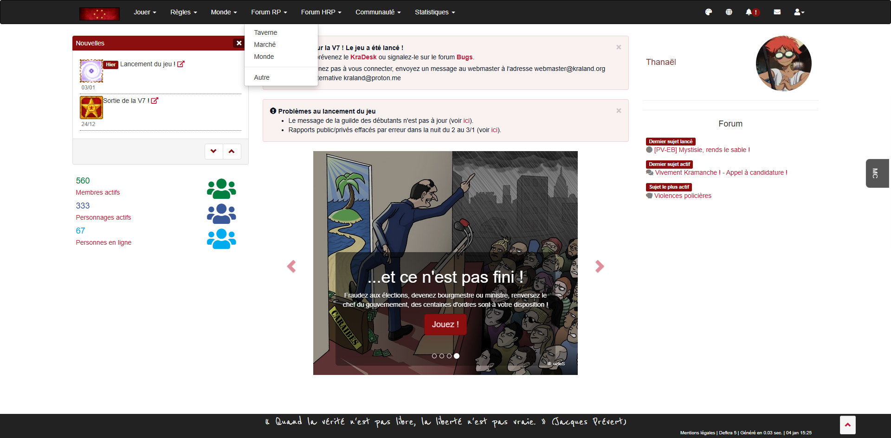
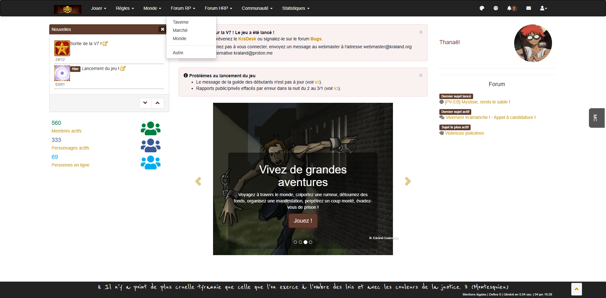
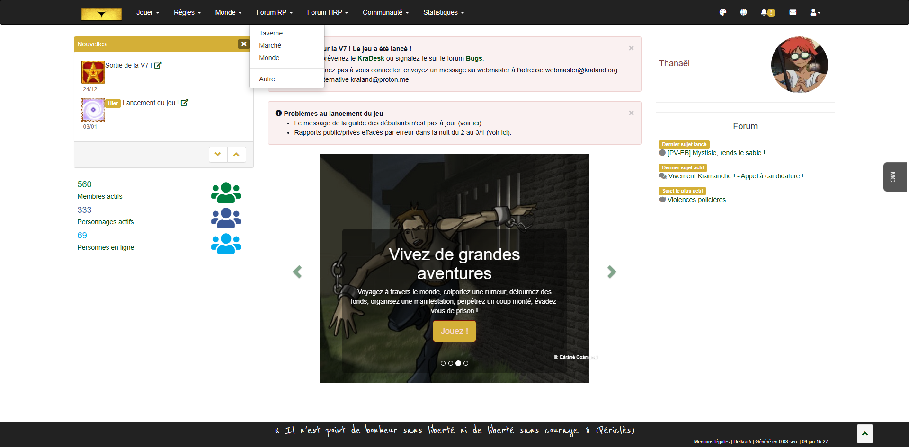
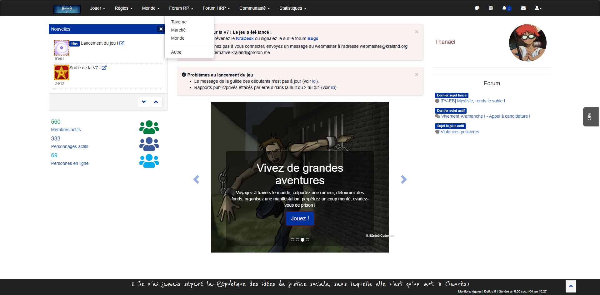
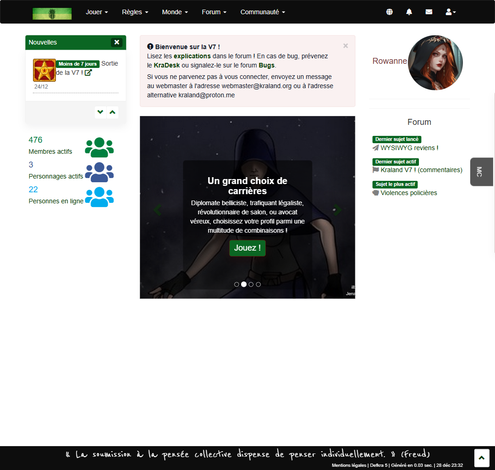
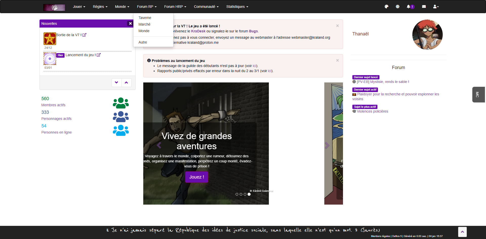
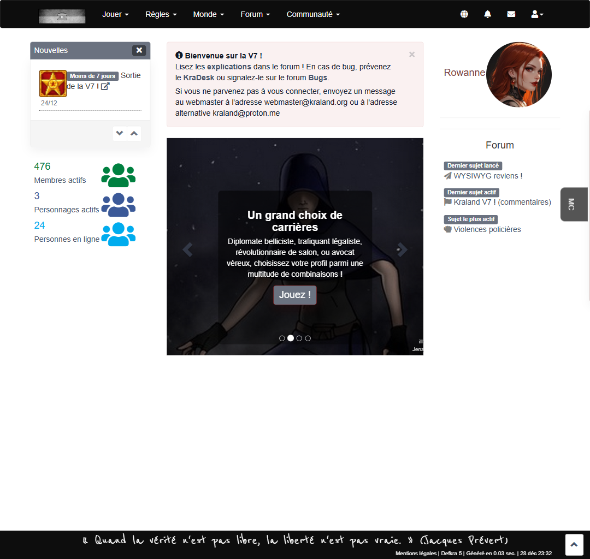
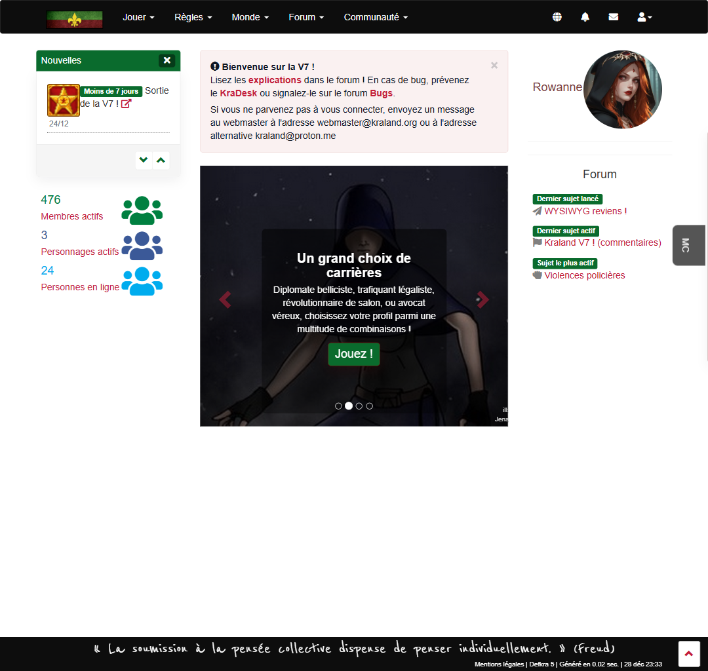
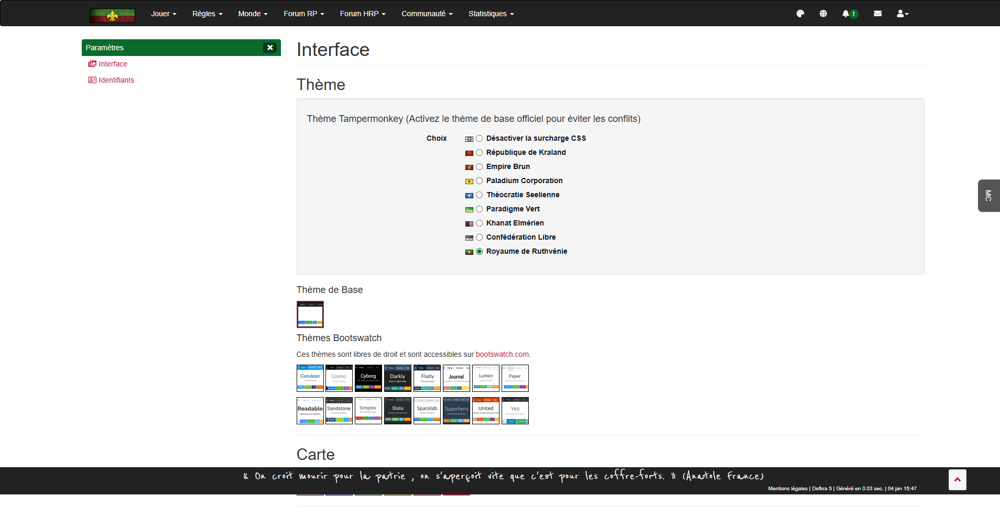

# Thème Kraland - UserScript Tampermonkey

Extension CSS/JavaScript pour moderniser l'interface de [Kraland Interactif](http://www.kraland.org) côté client.

## Développement

### Prérequis pour les développeurs

- Node.js (version 20 ou supérieure)
- npm

### Installation des dépendances

```bash
npm install
```

### Build du script

Le script principal `kraland-userscript-main.js` est généré automatiquement à partir du template et du CSS :

```bash
npm run build
```

Cette commande :
1. Lit le fichier CSS (`kraland-theme.css`)
2. Injecte le CSS dans le template JavaScript (`kraland-userscript-template.js`)
3. Génère le fichier final (`kraland-userscript-main.js`)
4. Met à jour le numéro de version avec un timestamp

⚠️ **Important** : Ne modifiez jamais `kraland-userscript-main.js` directement. Modifiez plutôt :
- `kraland-userscript-template.js` pour les changements JavaScript
- `kraland-theme.css` pour les changements CSS

Puis exécutez `npm run build` pour régénérer le fichier principal.

### Développement avec hot reload

Pour le développement avec rechargement automatique :

1. Démarrer le serveur local :
```bash
npm run serve
```

2. Utiliser le script de développement `kraland-userscript-dev.user.js` qui charge dynamiquement les fichiers depuis localhost:4848

3. Pour le watch automatique des changements :
```bash
npm run watch
```

### Linting

```bash
npm run lint          # Vérifie CSS et JS
npm run lint:fix      # Corrige automatiquement les problèmes
```

## Installation

### Prérequis

1. Installer l'extension [Tampermonkey](https://www.tampermonkey.net/) dans votre navigateur :
   - [Chrome/Edge](https://chrome.google.com/webstore/detail/tampermonkey/dhdgffkkebhmkfjojejmpbldmpobfkfo)
   - [Firefox](https://addons.mozilla.org/fr/firefox/addon/tampermonkey/)
   - [Safari](https://apps.apple.com/app/tampermonkey/id1482490089)

### Installation du script

#### Installation depuis une URL (recommandé)

1. Copier l'URL du fichier raw (exemple : `https://raw.githubusercontent.com/username/repo/main/kraland-userscript-main.js`)

2. Dans Tampermonkey : **Utilitaires** > **Installer depuis une URL**

3. Coller l'URL et cliquer sur **Installer**

4. Tampermonkey vérifiera automatiquement les mises à jour selon l'intervalle configuré

#### Configurer l'intervalle de vérification

1. Ouvrir **Tampermonkey** > **Tableau de bord**

2. Aller dans l'onglet **Paramètres** (icône d'engrenage)

3. Trouver la section **"Mise à jour des scripts"** :
   - **Vérifier les mises à jour** : ✓ Activer
   - **Intervalle de vérification** : Sélectionner **"Tous les 2 jours"** (48h)
   - **Mettre à jour automatiquement** : ✓ Activer (installe automatiquement les nouvelles versions)

4. Sauvegarder

Tampermonkey vérifiera désormais toutes les 48h si une nouvelle version est disponible et l'installera automatiquement.

#### Forcer une vérification manuelle

À tout moment, vous pouvez forcer la vérification :
- Clic droit sur l'icône Tampermonkey > **"Rechercher les mises à jour des scripts utilisateur"**

## Configuration du thème

### Accès à l'interface de configuration

1. Connectez-vous sur [www.kraland.org](http://www.kraland.org)

2. Naviguez vers **Profil > Interface** (`/profil/interface`)

3. Descendez jusqu'à la section **"Thème de base"** du site officiel

4. Juste au-dessus, vous trouverez une nouvelle section **"Thème Tampermonkey"** avec un formulaire de sélection

### Choix disponibles

Le script propose **9 variantes de thème** basées sur les différentes nations de Kraland :

| Thème | 
|-------|
| **République de Kraland** | 
| **Empire Brun** | 
| **Paladium Corporation** |
| **Théocratie Seelienne** | 
| **Paradigme Vert** | 
| **Khanat Elmérien** | 
| **Confédération Libre** | 
| **Royaume de Ruthvénie** | 
| **Désactiver** | 

### Persistance

Les préférences sont sauvegardées automatiquement dans le **localStorage** du navigateur et restent actives entre les sessions.


## Captures d'écran

Voici quelques captures d'écran des variantes de thème (fichiers dans `screenshots/`) :

<p align="center">



</p>

<p align="center">



</p>

<p align="center">



</p>


## Comment ça fonctionne

### Architecture technique

Le userscript `kraland-userscript-main.js` est une version **autonome** qui contient :
1. **CSS inline**
2. **Logique JavaScript**

### 1. Injection du CSS

```javascript
// Le CSS est stocké dans une constante
const BUNDLED_CSS = `/* 1050+ lignes de CSS optimisé */`;

// Au chargement de la page
function applyThemeInline(cssText) {
  let style = document.getElementById('kraland-theme-style');
  if (!style) {
    style = document.createElement('style');
    style.id = 'kraland-theme-style';
    document.head.appendChild(style);
  }
  style.textContent = cssText;
}
```

**Points clés** :
- Le CSS est injecté via un élément `<style>` dynamique dans le `<head>`
- L'ID de l'élément est `kraland-theme-style`
- Le CSS utilise des **variables CSS** (`--kr-primary`, `--kr-highlight`, etc.) pour faciliter les variantes

### 2. Système de variantes

Chaque variante modifie simplement quelques variables CSS :

```css
/* Variables par défaut */
:root {
  --kr-primary: #8b0f0e;
  --kr-highlight: #c41e3a;
  --kr-gold: #C69100;
}

/* Variante Empire Brun */
html.kr-theme-variant-empire-brun {
  --kr-primary: #5E3B2D;
  --kr-highlight: #C69100;
}
```

Le script JavaScript ajoute dynamiquement la classe correspondante à l'élément `<html>` :

```javascript
document.documentElement.classList.add('kr-theme-variant-empire-brun');
```

### 3. Améliorations du DOM

Le script ne fait pas que du CSS, il améliore aussi le HTML :

#### a) Remplacement du logo de la navbar

```javascript
function replaceNavbarBrand() {
  const brand = document.querySelector('.navbar-brand');
  const variant = localStorage.getItem('kr-theme-variant') || 'kraland';
  const logoIndex = getLogoIndexForVariant(variant); // 1-8 selon la variante
  const img = document.createElement('img');
  img.src = `http://img7.kraland.org/2/world/logo${logoIndex}.gif`;
  brand.innerHTML = '';
  brand.appendChild(img);
}
```

#### b) Footer sticky

```javascript
function ensureFooterSticky() {
  const footer = document.querySelector('footer');
  // Place le bouton "Remonter" dans le footer
  const backToTop = document.querySelector('a[href="#top"]');
  if (backToTop) footer.appendChild(backToTop);

  // Ajoute du padding au body pour éviter le chevauchement
  document.body.style.paddingBottom = '60px';
}
```

#### c) Relocation des statistiques

```javascript
function relocateKramailToLeft() {
  // Déplace "Membres actifs", "Personnages actifs", "Personnes en ligne"
  // de la colonne droite (#col-t) vers la colonne gauche (#col-left)
  const stats = document.querySelectorAll('.ds_users, .ds_characters, .ds_online');
  const leftColumn = document.getElementById('col-left');
  stats.forEach(stat => leftColumn.appendChild(stat));
}
```

#### d) Amélioration de l'accessibilité

- Remplacement des images `` par des symboles Unicode dans des `<span>` avec `aria-hidden`
- Conversion des images de sexe (♂/♀) en texte stylé
- Ajout de labels ARIA sur les boutons

### 4. Résilience et SPA

Le script surveille les modifications du DOM et les navigations :

```javascript
// MutationObserver pour surveiller la suppression du style
const observer = new MutationObserver(() => {
  if (!document.getElementById('kraland-theme-style')) {
    applyThemeInline(BUNDLED_CSS); // Réinjecter
  }
});
observer.observe(document.documentElement, { childList: true, subtree: true });

// Intercepter les navigations SPA (pushState/popstate)
const originalPushState = history.pushState;
history.pushState = function() {
  originalPushState.apply(this, arguments);
  setTimeout(() => ensureTheme(), 250);
};
```

### 5. Interface de configuration

L'interface est insérée dynamiquement sur `/profil/interface` :

```javascript
function insertTampermonkeyThemeUI() {
  // Trouve le titre "Thème de base"
  const heading = Array.from(document.querySelectorAll('h4'))
    .find(h => h.textContent.includes('Thème de base'));

  // Insère un formulaire radio avant cette section
  const form = document.createElement('form');
  form.innerHTML = `
    <div class="radio">
      <label>
        <input type="radio" name="kr-theme" value="kraland">
        République de Kraland
      </label>
    </div>
    <!-- ... autres options ... -->
  `;

  // Écouter les changements
  form.addEventListener('change', (e) => {
    const variant = e.target.value;
    applyThemeVariant(variant);
  });
}
```

## Support

Ce script est un projet personnel non affilié à Kraland. Pour toute question :

- Ouvrir une issue sur le repository GitHub

## Licence

Usage personnel pour [Kraland Interactif](http://www.kraland.org).
